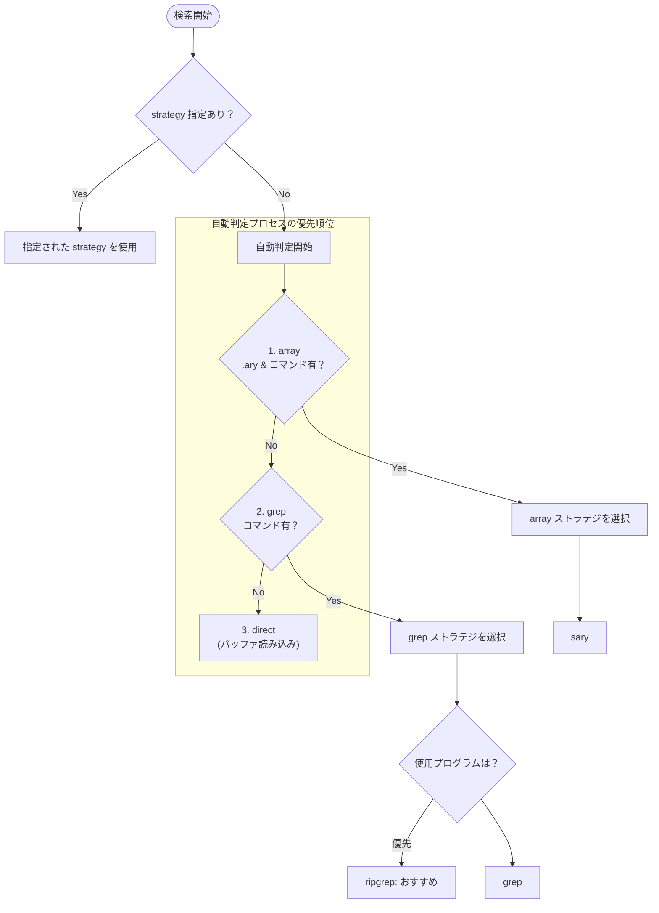

# SDIC

[SDIC](http://namazu.org/~tsuchiya/sdic/) は、Emacs 上で英和/和英辞書を閲覧するための簡潔 (simple) で、小さく (small) て、軽く (speedy) て、小粋 (smart) なプログラムです。

このリポジトリは、オリジナルの SDIC 2.1.3 をベースに、Emacs 30 以降のモダンな環境でエラーなく動作し、UTF-8 環境で快適に利用できることを目的に改修・リファクタリングを行ったフォーク版です。


## 特徴

- 派生語を自動的に検索します。
  英語には relation や lexicographic のように -tion / -ic などの語尾のついた派生語が頻繁に現れますが、これら単語が辞書中に見つからなかった場合、自動的に元々の語を検索します。

- 動詞や形容詞の規則変化や名詞の複数形を自動的に取り扱います。
  例えば、studies と入力すると、study を出力します。


## オリジナルからの変更点

- ripgrep による高速検索に対応：
  `exec-path` に `rg` が含まれている場合、SDIC はデフォルトの `grep` に替わって自動的に [ripgrep](https://github.com/BurntSushi/ripgrep) を grep ストラテジの検索バックエンドとして使用します。
  これにより、数百万行規模の大規模な辞書データであっても、GNU grep と比較して圧倒的（数倍〜数十倍）な体感速度で検索結果を表示します。

- sary による低負荷かつ高速な検索に対応：
  インデックスファイル (.ary) が存在し、`exec-path` に `sary` が含まれている場合、SDIC は `array` ストラテジの検索バックエンドとして [sary](https://sary.sourceforge.net/index.html.ja.html) を使用します。
  `sary` は Suffix Array ベースのインデックスを利用するため、検索時に毎回辞書ファイル全体を走査する必要がありません。初期セットアップとしてコマンドの導入とインデックス作成は必要ですが、検索時の負荷を抑えつつ高速に検索できます。


### 検索バックエンドの自動選択とコマンド優先順位

SDIC は環境に合わせて最適な戦略（ストラテジ）とコマンドを自動で選択します。以下の図は、初期化処理 (`sdicf-open`) 時の決定フローを表しています。



---

## インストール

### 1. 辞書データを入手する

SDIC の利用には別途辞書データが必要です。ここでは英辞郎テキスト版（有料）を使用する例を記載します。

- [英辞郎](https://edp.booth.pm/items/777563)
- [和英辞郎](https://edp.booth.pm/items/2066537)


### 2. SDIC形式へ変換

`contrib/` 配下のスクリプトを使用して入手したテキストデータを UTF-8 形式の `.sdic` ファイルに変換します。

**macOS（サンプルデータでの変換例）:**

```sh
# サンプルデータのダウンロード
curl -O https://www.eijiro.jp/eijiro-sample-144-10.zip
curl -O https://www.eijiro.jp/waeiji-144-10-sample.txt

# 解凍
unzip eijiro-sample-144-10.zip

# 必要なツールのインストール
brew install nkf

# 変換
nkf -S -X -e EIJIRO-SAMPLE-144-10.TXT | perl /path/to/eijirou.perl | nkf -E -w >eijiro.sdic
nkf -S -X -e waeiji-144-10-sample.txt | perl /path/to/eijirou.perl | nkf -E -w >waeiji.sdic
```


### 3. 設定例 (use-package)

```elisp
(use-package sdic
  :vc (:url "https://github.com/video/sdic") ;; Emacs 30+ の package-vc を使用する場合
  :bind (("C-c w" . sdic-describe-word)
         ("C-c W" . sdic-describe-word-at-point))
  :custom
  ;; 見出し語のスタイル
  (sdic-face-style 'font-lock-keyword-face)
  ;; 検索結果表示ウインドウの高さ
  (sdic-window-height 20)
  ;; 辞書ファイル
  (sdic-eiwa-dictionary-list
   '((sdicf-client "/path/to/your/eijiro.sdic")))
  (sdic-waei-dictionary-list
   '((sdicf-client "/path/to/your/waeiji.sdic"))))

```


## 使い方

詳細な使用方法やキーバインドについては、同梱の `sdic.texi` をコンパイルして Info で閲覧するか、以下のオリジナル版リファレンスを参照してください。

- [SDIC Reference Manual](http://namazu.org/~tsuchiya/sdic/info/)


## クレジット

- Original Author: TSUCHIYA Masatoshi (`<tsuchiya@namazu.org>`)
